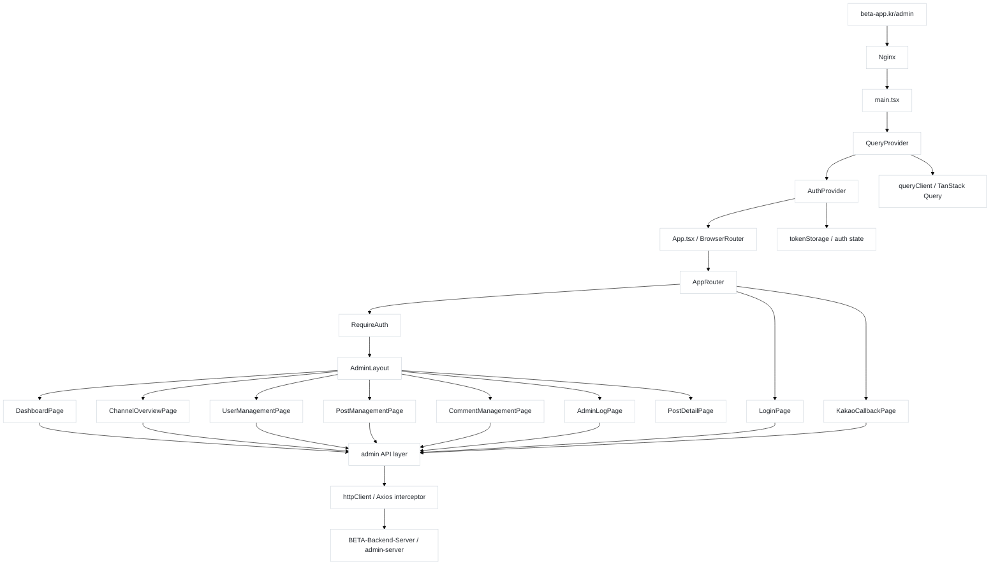

## 📝 Introduction

**BETA Admin Web**은 BETA 서비스 운영을 위한 내부 관리자 웹입니다.<br />
운영에 필요한 정보 확인과 관리 작업을 한 사이트에서 처리할 수 있도록 구성했습니다.<br />
`React`, `TypeScript`, `Vite`를 기반으로 하며 관리자 API 통신은 `Axios`, 서버 상태 관리는 `TanStack Query`를 사용합니다.

BETA 앱과 동일한 도메인을 사용하여 `/admin` 경로로 분리해 운영하고, 운영 권한을 가진 관리자만 접근할 수 있습니다.<br />
서비스는 [beta-app.kr/admin](https://beta-app.kr/admin)에서 제공되며, 관리자 기능은 [BETA-Backend-Server](https://github.com/BETA-BasEball-Together-Always/BETA-Backend-Server)의 `admin-server` 모듈과 연동됩니다.

## 🔀 System Flow



`/admin` 경로로 진입한 요청은 라우팅과 인증 레이어를 거쳐 관리자 화면으로 연결되며,<br />
각 페이지는 공통 API 레이어를 통해 `BETA-Backend-Server`의 `admin-server`와 통신합니다.

## 🧩 Architecture

```text
src
├─ app
│  ├─ providers
│  │  ├─ AuthProvider.tsx
│  │  └─ QueryProvider.tsx
│  └─ router
│     ├─ AppRouter.tsx
│     └─ RequireAuth.tsx
├─ features
│  ├─ auth
│  │  └─ pages
│  │     ├─ LoginPage.tsx
│  │     └─ KakaoCallbackPage.tsx
│  └─ admin
│     ├─ layouts
│     │  └─ AdminLayout.tsx
│     ├─ components
│     │  ├─ AdminPagination.tsx
│     │  └─ AdminActionReasonModal.tsx
│     └─ pages
│        ├─ DashboardPage.tsx
│        ├─ ChannelOverviewPage.tsx
│        ├─ UserManagementPage.tsx
│        ├─ PostManagementPage.tsx
│        ├─ PostDetailPage.tsx
│        ├─ CommentManagementPage.tsx
│        └─ AdminLogPage.tsx
└─ shared
   ├─ api
   ├─ auth
   ├─ config
   └─ query
```

`app`은 진입점과 라우팅, `features`는 관리자 기능 단위 화면, `shared`는 인증, API, query 설정 같은 공통 영역을 담당합니다.

## 🚀 CI/CD

- CI는 `pull_request`와 주요 브랜치 `push`에서 `npm run lint`와 `npm run build`를 검증합니다.
- CD는 `main` 브랜치에서 CI가 성공하면 빌드 결과물 `dist`를 운영 웹 서버 `Nginx`의 admin 정적 파일 경로에 배포합니다.


